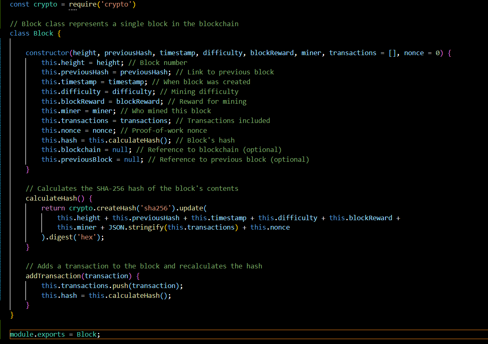
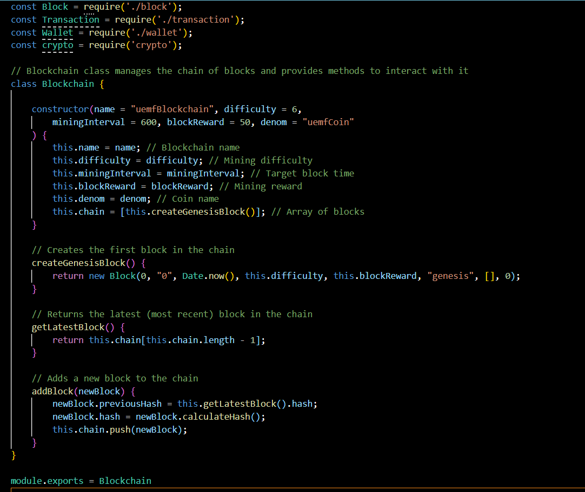
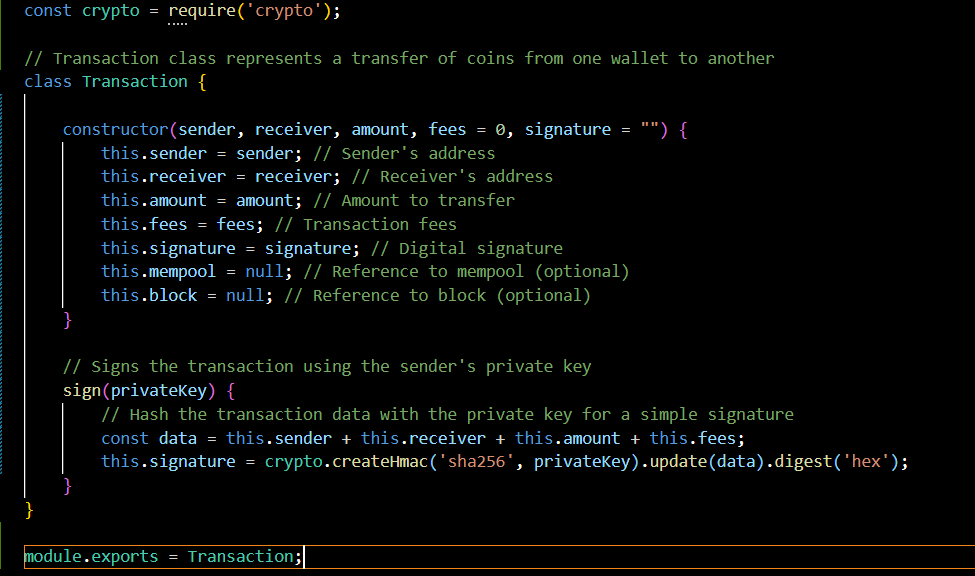
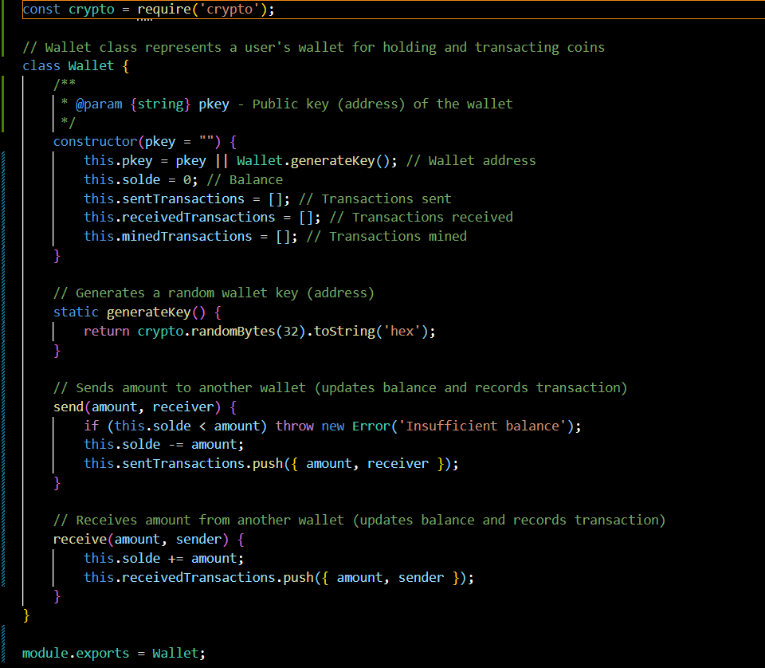
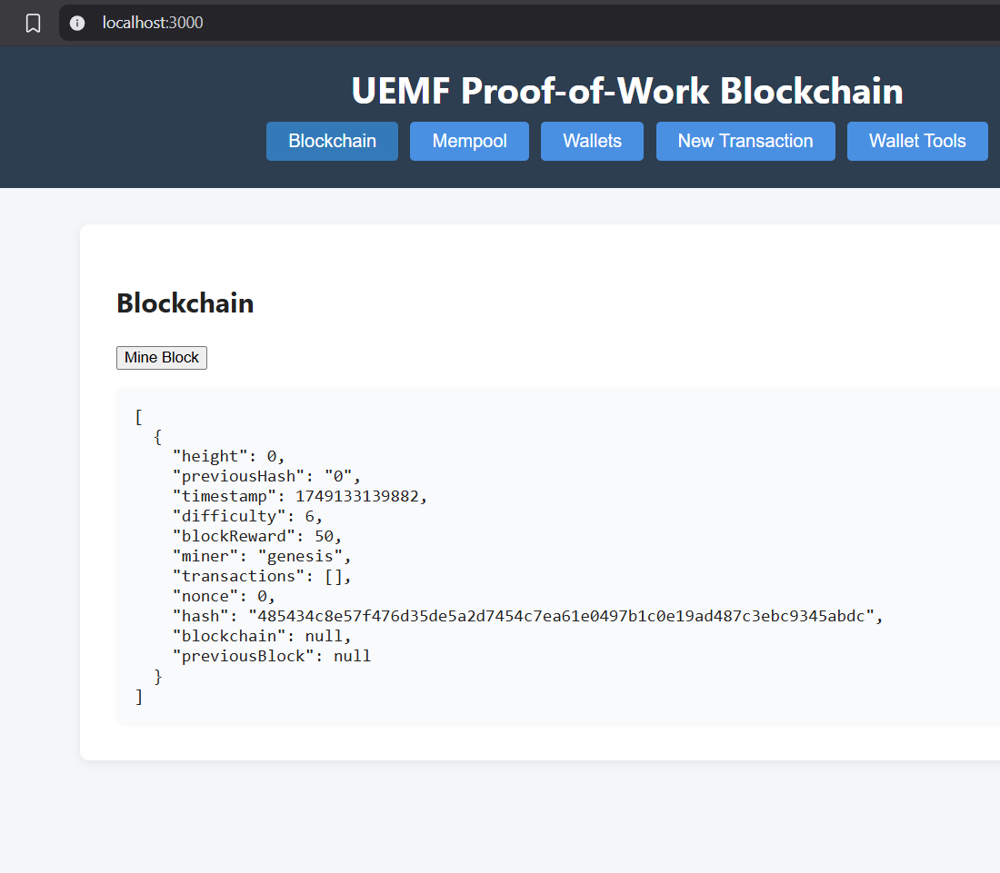
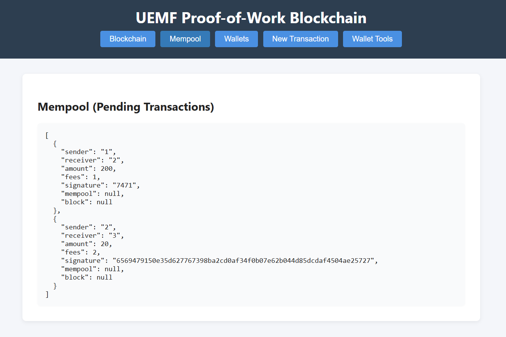
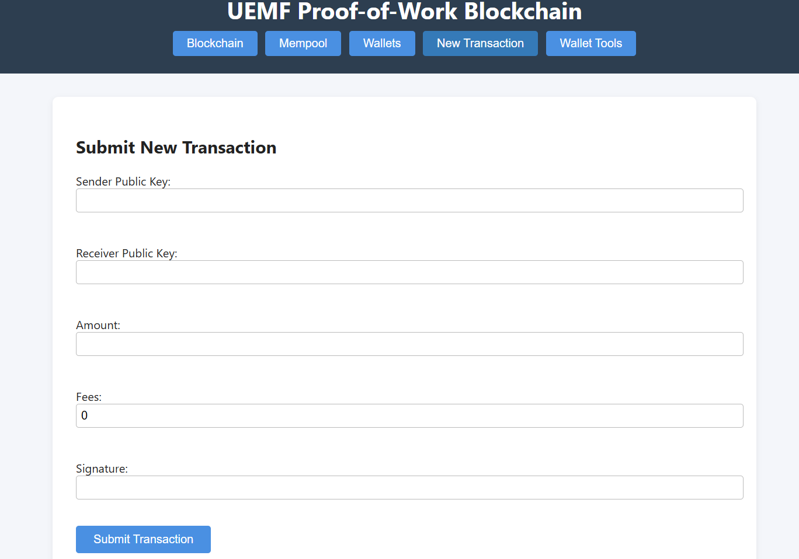
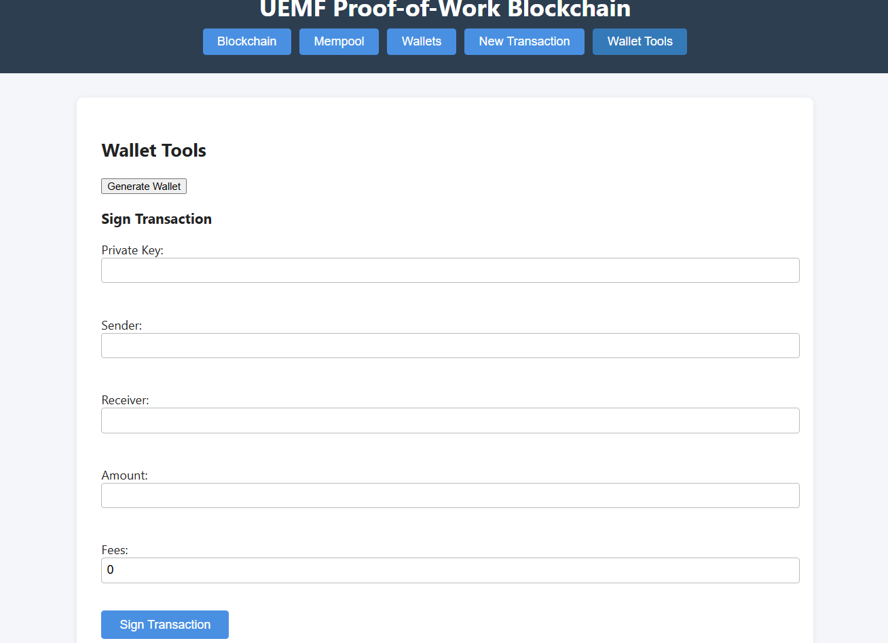
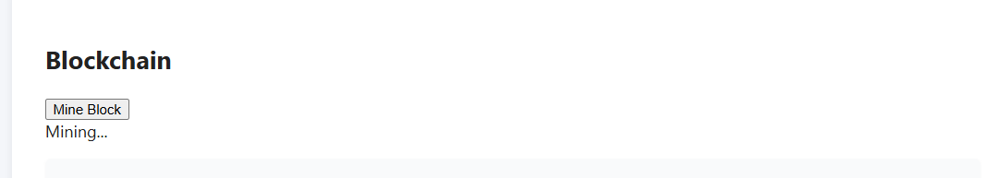

# UEMF PROOF OF WORK BLOCKCHAIN

**Authors**: Benmaamar Moussaab & Dghoghi Adam

## Overview

In this project, we will create a local blockchain that mimics a simplified proof-of-work (PoW) system using Node.js. This will provide us with hands-on experience in blockchain fundamentals, including block generation, transaction management, proof-of-work consensus, and wallet security. We will also build a web interface to visualize the blockchain, mempool, and to interact with transactions.


## Features

- **Core Models**: Block, Blockchain, Wallet, and Transaction classes
- **Persistence Layer**: File-based storage for blocks, blockchain, wallets, and mempool
- **Mining System**: Simple proof-of-work mining and transaction logic
- **Web Interface**: User-friendly UI for blockchain visualization and interaction
- **CLI Interface**: Command-line tools for blockchain operations
- **Wallet Management**: Secure wallet generation, transaction signing, and balance tracking
- **Transaction Pool**: Mempool management for pending transactions

## PROJECT ARCHITECTURE

### Core Models (`models/`)

#### Block (`models/block.js`)
Defines the structure and behavior of individual blocks in the blockchain.
- **Properties**: `height`, `previousHash`, `timestamp`, `difficulty`, `blockReward`, `miner`, `transactions`, `nonce`, `hash`, `blockchain`, `previousBlock`
- **Key Methods**:
  - `constructor(...)`: Initializes a block
  - `calculateHash()`: Computes SHA-256 hash of block contents
  - `addTransaction(transaction)`: Adds transactions and recalculates hash

<p align="center">
  
</p>

#### Blockchain (`models/blockchain.js`)
Manages the chain of blocks and provides methods for blockchain operations.
- **Properties**: `name`, `difficulty`, `miningInterval`, `blockReward`, `denom`, `chain`
- **Key Methods**:
  - `constructor(...)`: Initializes blockchain with genesis block
  - `createGenesisBlock()`: Creates the first block
  - `getLatestBlock()`: Returns the most recent block
  - `addBlock(newBlock)`: Adds new blocks to the chain

<p align="center">
  
</p>

#### Transaction (`models/transaction.js`)
Represents transactions between wallets with digital signature support.
- **Properties**: `sender`, `receiver`, `amount`, `fees`, `signature`, `mempool`, `block`
- **Key Methods**:
  - `constructor(...)`: Initializes a transaction
  - `sign(privateKey)`: Signs transactions using HMAC-SHA256

<p align="center">
  
</p>

#### Wallet (`models/wallet.js`)
Manages user wallets with sending/receiving capabilities and transaction tracking.
- **Properties**: `pkey`, `solde`, `sentTransactions`, `receivedTransactions`, `minedTransactions`
- **Key Methods**:
  - `constructor(pkey)`: Initializes a wallet
  - `static generateKey()`: Generates random wallet keys
  - `send(amount, receiver)`: Sends coins to another wallet
  - `receive(amount, sender)`: Receives coins from another wallet

<p align="center">
  
</p>

### Persistence Layer (`persistence/`)

#### Blockchain Persistence (`persistence/blockchainPersistence.js`)
Handles blockchain metadata and configuration storage.
- `ensureBlockchainFile()`: Ensures blockchain config file exists
- `saveBlockchain(blockchain)`: Saves blockchain metadata
- `loadBlockchain()`: Loads blockchain metadata

#### Block Persistence (`persistence/blockPersistence.js`)
Manages individual block storage and retrieval.
- `ensureBlocksDir()`: Ensures blocks directory exists
- `loadBlocks()`: Loads all blocks from disk
- `saveBlock(block)`: Saves individual blocks
- `saveBlocks(blocks)`: Saves multiple blocks
- `getBlock(hash)`: Retrieves blocks by hash
- `getBlockByHeight(height)`: Retrieves blocks by height

#### Mempool Persistence (`persistence/mempoolPersistence.js`)
Handles pending transaction management.
- `ensureMempoolFile()`: Ensures mempool file exists
- `getAllTransactionsMempool()`: Loads all mempool transactions
- `addTransactionMempool(tx)`: Adds transactions to mempool
- `removeTransactionMempool({signature})`: Removes transactions by signature
- `saveMempool(mempool)`: Saves mempool state

#### Wallet Persistence (`persistence/walletPersistence.js`)
Manages wallet data storage.
- `ensureWalletFile()`: Ensures wallet file exists
- `getAllWallets()`: Loads all wallets
- `saveAllWallets(wallets)`: Saves all wallet data

### Database Storage (`database/`)
Stores persistent data as JSON files:
- `blockchain.json`: Blockchain metadata and configuration
- `wallet.json`: Wallet data and balances
- `mempool.json`: Pending transactions
- `blocks/`: Directory containing individual block files

### Web Interface (`public/`)

#### Frontend (`public/index.html` & `public/app.js`)
- **Tabbed Interface**: Blockchain viewer, Mempool, Wallets, New Transaction, Wallet Tools
- **Interactive Features**:
  - Real-time blockchain and mempool visualization
  - Transaction creation and submission forms
  - Wallet generation and management tools
  - In-browser mining capabilities (demo purposes)
  - Digital signature creation and verification

## PROJECT WORKFLOW

### 1. Server Setup
- Start Express server
- Initialize blockchain with genesis block
- Set up timer for block creation (configurable interval, default 10 minutes)

### 2. Transaction Processing
- Users create transactions via web interface
- Client sends transactions to server
- Server validates transactions (including digital signature verification)
- Valid transactions added to mempool

### 3. Mining and Block Generation
- Clients select transactions from mempool
- Begin proof-of-work process
- First client to solve PoW submits valid block
- Server confirms block, updates blockchain, rewards miner

### 4. UI Updates
- Web app displays latest blockchain state
- Real-time mempool transaction updates
- Wallet balance updates
- Transaction interface with fee specification

## Setup and Installation

1. **Install dependencies**:
   ```bash
   npm install
   ```

2. **Start the blockchain server**:
   ```bash
   npm start
   # or
   node server.js
   ```

3. **Access the web interface**:
   Open your browser and navigate to `http://localhost:3000`

4. **Run tests**:
   ```bash
   npm test
   ```

## USAGE GUIDE

### Getting Started
1. **Start the server** using `node server.js`
2. **Open your browser** to `http://localhost:3000`
3. **Generate wallets** using the Wallet Tools tab
4. **Create transactions** in the New Transaction tab
5. **Mine blocks** to process transactions and earn rewards


### Web Interface Features

The application provides a comprehensive web interface with multiple tabs:

<div align="center">
  
</div>

<p align="center">
  
</p>

<p align="center">
  
</p>

<p align="center">
  
</p>

### Mining Process
When you mine a block:
1. Click "Mine Block" - mining message appears

<p align="center">
  
</p>

2. Browser performs proof-of-work (CPU intensive)
3. Mining time varies (seconds to minutes depending on difficulty)
4. Successful block submission updates blockchain
5. Included transactions removed from mempool
6. Miner receives block reward (e.g., 50 uemfCoin)
7. Wallet balances update accordingly

### Wallet Management
- Generate new wallet keys using built-in tools
- Sign transactions with private keys
- Track sent, received, and mined transactions
- Monitor wallet balances in real-time

## DIRECTORY STRUCTURE

```
├── models/              # Core blockchain data models
│   ├── block.js         # Block class definition
│   ├── blockchain.js    # Blockchain management
│   ├── transaction.js   # Transaction handling
│   └── wallet.js        # Wallet operations
├── persistence/         # Data persistence layer
│   ├── blockchainPersistence.js
│   ├── blockPersistence.js
│   ├── mempoolPersistence.js
│   └── walletPersistence.js
├── database/            # JSON data storage
│   ├── blockchain.json  # Blockchain metadata
│   ├── wallet.json      # Wallet data
│   ├── mempool.json     # Pending transactions
│   └── blocks/          # Individual block files
├── public/              # Web interface files
│   ├── index.html       # Main UI
│   └── app.js           # Frontend logic
├── server.js            # Express server and API
├── test.js              # Test and demo script
└── README.md            # This file
```


## TECHNICAL DETAILS

### Security Features
- HMAC-SHA256 transaction signing
- Digital signature verification
- Secure wallet key generation
- Transaction validation before mempool inclusion

### Performance Considerations
- File-based persistence for reliability
- Efficient block storage and retrieval
- Optimized mining algorithms
- Responsive web interface during mining operations

## TESTING

The project includes comprehensive testing capabilities:
- Persistence layer testing
- Transaction validation testing
- Mining process verification
- Wallet operation testing


---

 
